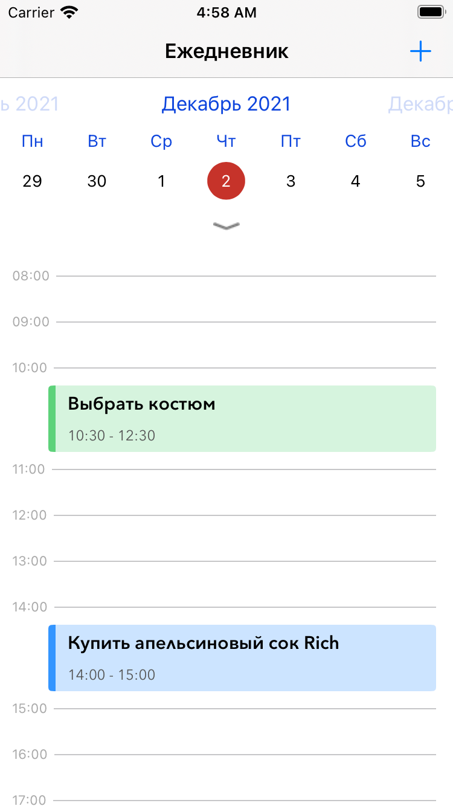
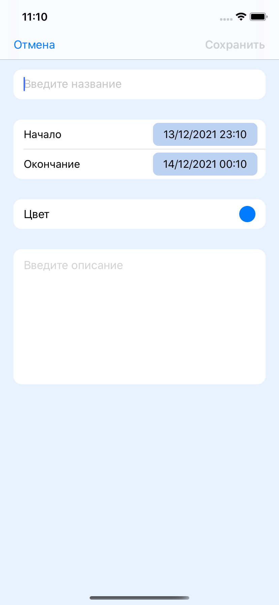
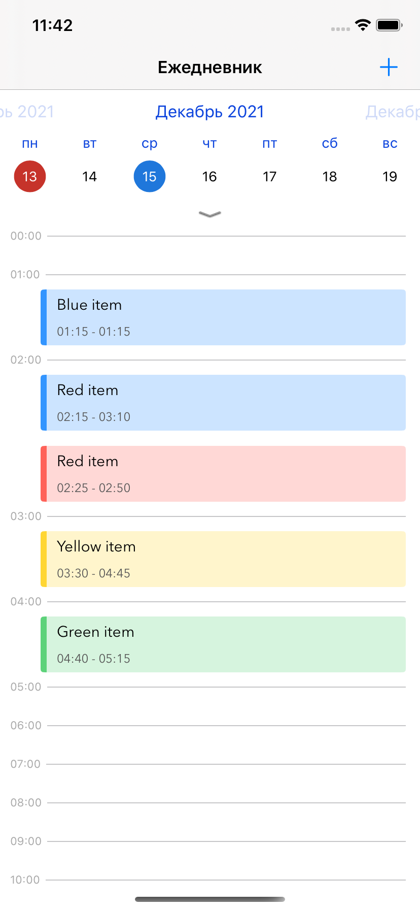
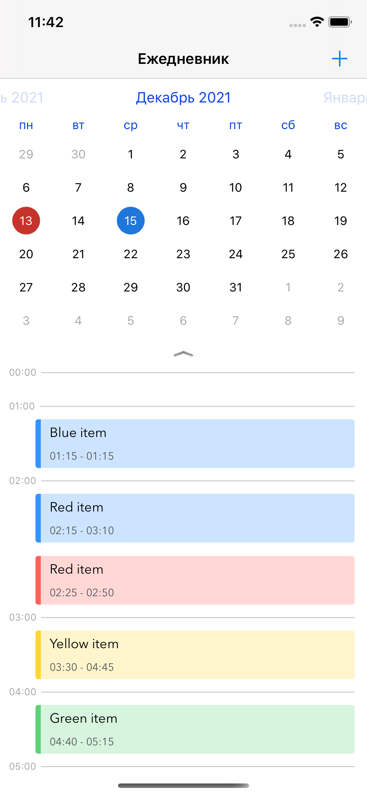
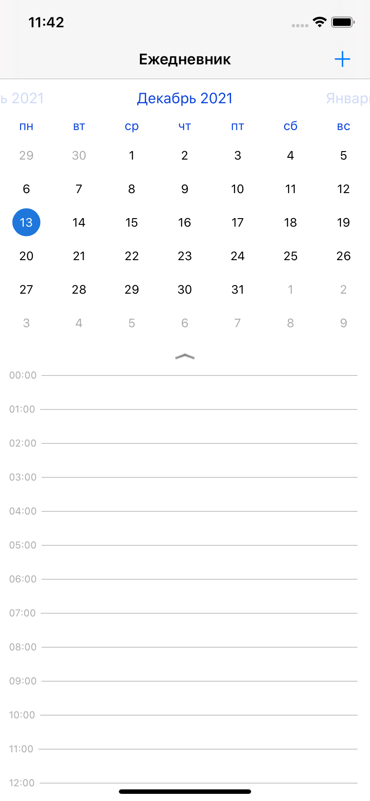

<!-- PROJECT LOGO -->
 

  <h3 align="center">TaskPlanner</h3>
  

    Daily planner app
  

<!-- TABLE OF CONTENTS -->

  
Table of Contents

  <ol>
    <li>
      <a href="#about-the-project">About The Project</a>
    </li>
    <li>
      <a href="#screenshots">Screenshots</a>
    </li>
  </ol>

<!-- ABOUT THE PROJECT -->
## About The Project

<!--[![Main screen of application][product-screenshot]]-->

Main screen of application
 

    

 

Application for keeping a diary. It is possible to add a new todo-item. When adding a new todo-item, the title, description, start and finish times are insisted.

(<a href="#top">back to top</a>)

### Screenshots

<!--Add todo-item screen-->

    

 

<!--Add todo-item filled screen-->

    

 

<!-- Choose todo-item color -->

    

 

<!--Todo-list view with calendar and timetable-->

    

 

    

 

    

 

<!--Todo-item details-->

    

 

<!--Todo-list empty view with calendar and timetable-->

    

 

<!-- [![Add todo-item screen][options-screenshot]] { width: 150px; }
[![Choose todo-item color][colors-screenshot]] { width: 150px; }
[![Todo-list view with calendar and timetable][todolist-screenshot]] { width: 150px; }
[![Todo-item details][details-screenshot]] { width: 150px; } -->

<!-- MARKDOWN LINKS & IMAGES -->

[product-screenshot]: images/screenshot.png
[options-screenshot]: images/options.png
[todolist-screenshot]: images/todolist.png
[details-screenshot]: images/details.png
[colors-screenshot]: images/colors.png
