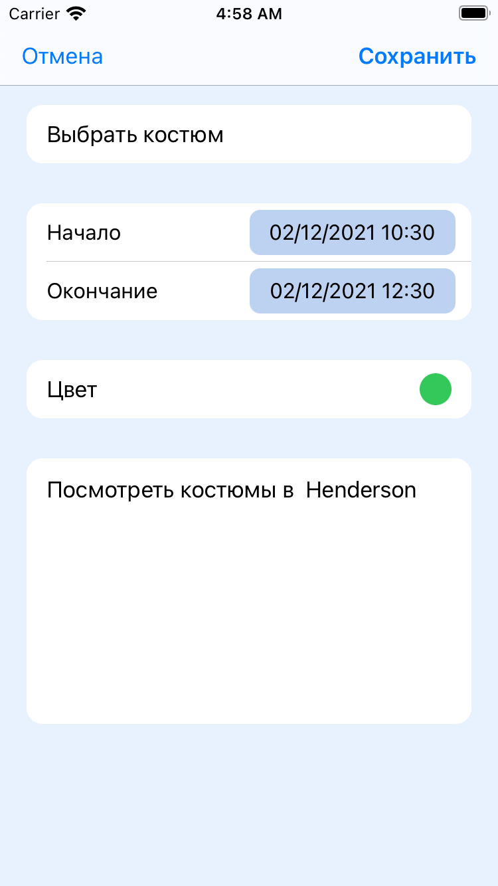
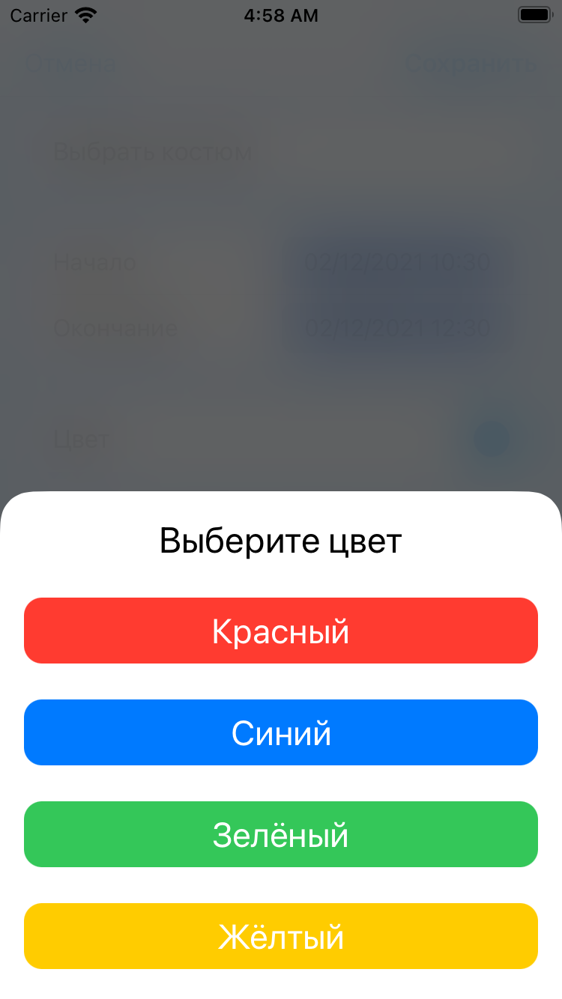
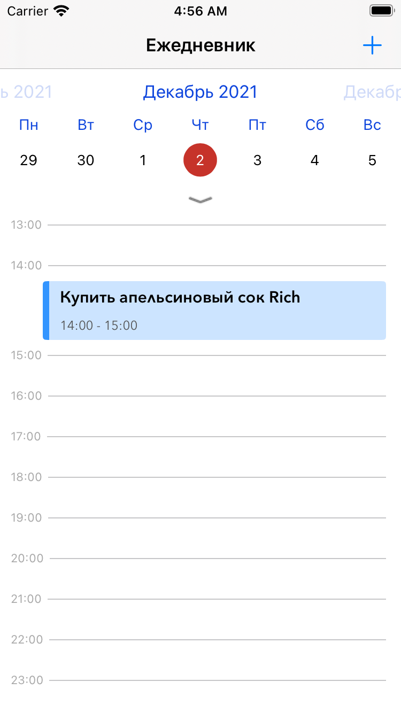
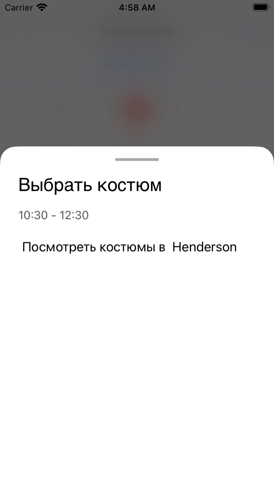

<!-- PROJECT LOGO -->
 

  <h3 align="center">TaskPlanner</h3>
  

    Daily planner app
  

<!-- TABLE OF CONTENTS -->

  
Table of Contents

  <ol>
    <li>
      <a href="#about-the-project">About The Project</a>
    </li>
    <li>
      <a href="#screenshots">Screenshots</a>
    </li>
  </ol>

<!-- ABOUT THE PROJECT -->
## About The Project

[![Main screen of application][product-screenshot] | width="150"]

Application for keeping a diary. It is possible to add a new todo-item. When adding a new todo-item, the title, description, start and finish times are insisted.

<!-- Here's why:
* Your time should be focused on creating something amazing. A project that solves a problem and helps others
* You shouldn't be doing the same tasks over and over like creating a README from scratch
* You should implement DRY principles to the rest of your life :smile: -->

(<a href="#top">back to top</a>)

### Screenshots

Add todo-item screen

 

Choose todo-item color

 

Todo-list view with calendar and timetable

 

Todo-item details

<!-- [![Add todo-item screen][options-screenshot]] { width: 150px; }
[![Choose todo-item color][colors-screenshot]] { width: 150px; }
[![Todo-list view with calendar and timetable][todolist-screenshot]] { width: 150px; }
[![Todo-item details][details-screenshot]] { width: 150px; } -->

<!-- MARKDOWN LINKS & IMAGES -->

[product-screenshot]: images/screenshot.png
[options-screenshot]: images/options.png
[todolist-screenshot]: images/todolist.png
[details-screenshot]: images/details.png
[colors-screenshot]: images/colors.png
